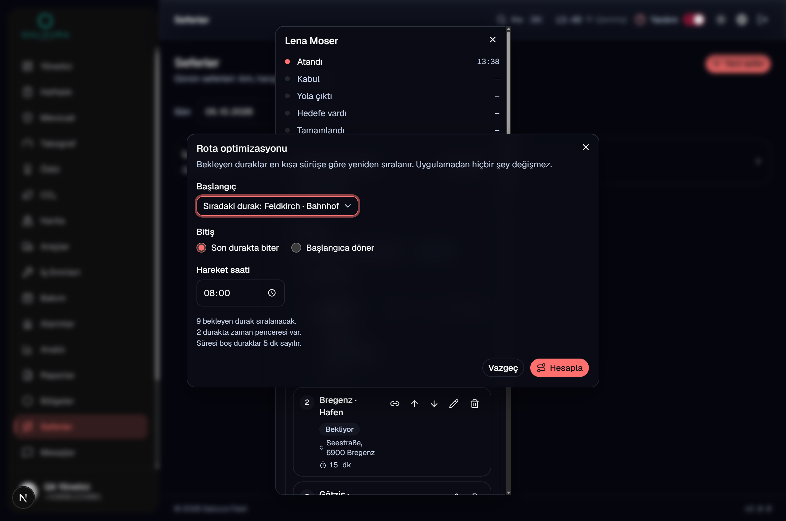
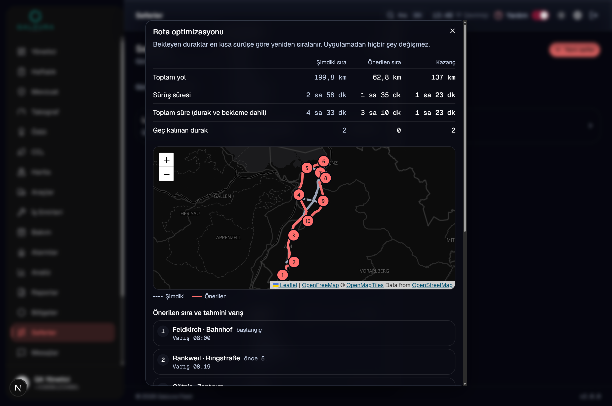
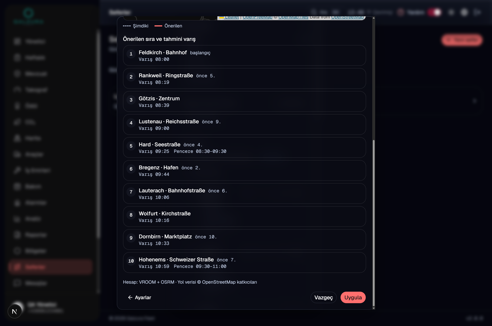
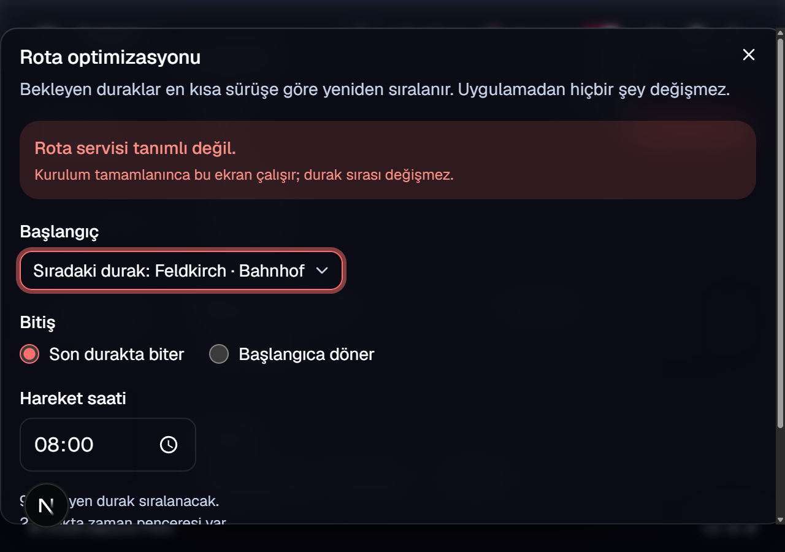

# Rota optimizasyonu — Faz 1: tek araç durak sıralama

**sağlayıcı: VROOM+OSRM (18 Tem kurulumu), Google yedek**

**Tarih:** 03.10.2026 · **Dal:** `rota-optimizasyonu` (taban `e486c4b`) · **Paket:** Premium
**Durum:** Kod, test, belge hazır · 🔴 **main'e merge YOK, production deploy YOK** ·
demo / HAK61 / Sendigo veritabanına **yazılmadı**, migration **yok**.
⏳ **Volkan'da:** sunucuda vekil + tünel (§5), Vercel env (§6), isteğe bağlı Google yedeği (§9).

| İşaret | Anlamı |
|---|---|
| **[DOĞRULANDI]** | Bu turda çalıştırıldı, sonucu burada |
| **[VARSAYIM]** | Çıkarım ya da hesap girdisi — ölçüm değil |
| **[ÖLÇÜLMEDİ]** | Yapılmadı; nedeni §13'te |

---

## 0 · Bir bakışta

| Soru | Cevap |
|---|---|
| Ne yapar | Bir seferin **bekleyen** duraklarını tek araç için en kısa/verimli sıraya dizer. Önce/sonra karşılaştırması (km, sürüş, toplam süre, geç kalınan durak), durak başına tahmini varış, iki rotalı harita. **Uygula** mevcut `sira` alanını günceller, **Vazgeç** hiçbir şeyi değiştirmez |
| Nerede | Panel › Seferler › sefer › Duraklar › **"Durakları en iyi sıraya diz"** (≥ 3 bekleyen durakta etkin) |
| Sağlayıcı | **VROOM 1.13 + OSRM**, Hetzner'de kendi sunucumuz, OSM Avusturya verisi. **Google Route Optimization yalnız yedek** — anahtar yoksa pasif |
| Modül şalteri | `ROTA_OPTIMIZASYONU` (env, mevcut modül deseni, migration yok). Varsayılan **kapalı**; demo niyeti **açık** (`check-demo-env`) |
| Maliyet | VROOM: çağrı başına **0 $**. Google yedek: 12 duraklı hesap ≈ **0,13 $** (liste fiyatı), yalnız birincil ulaşılamazsa |
| Koruma | Şirket başına günde **100 hesap** (`ROTA_GUNLUK_TAVAN`), tek hesapta ≤ **100 durak** (`ROTA_AZAMI_DURAK`), **her çağrı `audit_log`'a** |
| Durak koordinatı | **VAR** — 082 modeli lat/lng + bölge merkezi taşıyor; **geocoding gerekmedi, eklenmedi** (§3) |
| Veritabanına ne yazılır | Hesapla: 1 `audit_log` satırı + `login_attempts`'te 1 sayaç satırı. Uygula: `sefer_duraklari.sira` (082'nin RPC'si) + 1 `audit_log` satırı |





*Yerel yığında, gerçek motorla (VROOM + OSRM, SSH tüneli üzerinden), 10 duraklı
demo tohumu. Servis tanımsızken ekran:*



---

## 1 · Sağlayıcı kararı — ölçüm (03.10.2026)

### 1.1 Kasadaki kurulum

Kaynak: galzura-brain `rota-motoru-osrm-vroom.md` (kurulum 18.07.2026, "Faz 0").
Sunucu: Hetzner CX33 (Nürnberg) · `178.104.143.207` · 4 vCPU · 8 GB.

| | OSRM | VROOM |
|---|---|---|
| Konteyner | `osrm-austria` | `vroom` |
| İmaj | `ghcr.io/project-osrm/osrm-backend` (v26.7.3) | `vroomvrp/vroom-docker:v1.13.0` (vroom-express) |
| Bağ | **`127.0.0.1:5000`** — yalnız localhost | **`127.0.0.1:3000`** — yalnız localhost |
| Ayar | MLD, `car` profili | OSRM'e docker ağı `galzura-routing` üstünden `osrm-austria:5000` |
| Yeniden başlama | `--restart unless-stopped` | `--restart unless-stopped` |
| Durum (03.10) [DOĞRULANDI] | `Up 2 months` | `Up 2 months (healthy)` |
| Bellek (03.10) [DOĞRULANDI] | 128 MiB (+ dosya önbelleği) | 37 MiB |

Makinede 03.10'da **5,4 GB** kullanılabilir bellek vardı [DOĞRULANDI, `free -m`].

### 1.2 Ayakta mı, ne kadar hızlı [DOĞRULANDI]

Sunucunun içinden (`ssh root@…` + `curl`), 03.10.2026:

| Ölçüm | Sonuç |
|---|---|
| VROOM `GET /health` | **200**, 34 ms |
| OSRM Dornbirn → Bregenz, ×3 | **16,42 km / 19,3 dk** — 18 Tem doğrulamasıyla birebir · 433 ms (soğuk), 15 ms, 8 ms |
| VROOM, Vorarlberg'de 5 durak (çıkış/dönüş Dornbirn; Götzis, Wolfurt, Lauterach, Lustenau, Hard; durak başı 5 dk), ×3 | `code 0`, atanamayan **0**, 52,0 km, sürüş 72 dk + servis 25 dk · **1,39 s (soğuk), 76 ms, 68 ms** · motor içi: yükleme 26 ms, çözüm 1 ms, yönlendirme 8 ms |
| Panel eylemi uçtan uca (10 durak = 3 çağrı: şimdiki sıranın rotası + VROOM + önerilen sıranın rotası) | **≈ 390 ms** — yerel panel → yerel vekil → SSH tüneli → sunucu. Vercel → sunucu yolu [ÖLÇÜLMEDİ] |
| 8 duraklı kötü sıra (verify-rota H) | 217,2 km / 268 dk → **91,2 km / 188 dk**, 303 ms |
| 50 durak (verify-rota H) | 692,2 → **221,4 km**, 521 ms |

### 1.3 Harita kapsamı ve tarihi [DOĞRULANDI]

**Veri:** Geofabrik `europe/austria`, OSM zaman damgası **2026-07-16T20:21:30Z**
(replikasyon sırası 4849; pbf başlığından okundu), 17.07.2026'da işlendi.
03.10 itibarıyla **≈ 2,5 aylık**.

**Kapsam: yalnız Avusturya.** OSRM `nearest` ile yola yapışma mesafesi:

| Nokta | Yapışma | Yorum |
|---|---|---|
| Dornbirn (AT) | 1 m | ✓ |
| Feldkirch (AT) | 9 m | ✓ |
| St. Margrethen (CH, sınırda) | 261 m | Avusturya tarafındaki yola yapışıyor — İsviçre yolu yok |
| Lindau (DE, sınıra 3 km) | 3.380 m | ✗ Almanya yok |
| Vaduz (LI) | 8.574 m | ✗ |
| München (DE) | 59,6 km | ✗ |
| İstanbul (TR) | 1.200 km | ✗ Türkiye yok |

Kod bunu `YAPISMA_SINIRI_M = 1000` ile yakalar (`lib/rota/plan.ts`): bir durak
yola 1 km'den uzaksa hesap **`harita_disi`** ile durur, durak adları ekranda,
sıra değişmez. Sınır ölçüldü: Bregenz → Lindau rotasında yapışma [25, 3596] m →
yakalandı; seed'deki 10 durağın hepsi ≤ 36 m.

### 1.4 Karar

**Birinci sağlayıcı VROOM + OSRM**, çünkü:

- ayakta ve ölçüldü; çağrı başına **dış maliyet yok**;
- Faz 1'in istediği her şeyi çözüyor: zaman penceresi, durak süresi,
  başlangıç / bitiş / depoya dönüş, 50+ durak (521 ms);
- durak koordinatları **bizim sunucumuzda kalıyor** — üçüncü taraf yok;
- sonuç OSM türevi → kendi haritamızda (OpenFreeMap) **koşulsuz** çizilebilir
  (Google'da koşullu — §10).

Sınırları: yalnız Avusturya · trafik yok (serbest akış süreleri) · veri elle
güncelleniyor · tek sunucu. **Google yedeği son madde içindir.**

### 1.5 Google yedek — neden (b) Route Optimization

| | (a) Routes `computeRoutes` + `optimizeWaypointOrder` | **(b) Route Optimization `optimizeTours`** |
|---|---|---|
| Durak sınırı | **25 ara nokta** | 50+ (gönderi) |
| Zaman penceresi | yok | **var** |
| Durak süresi | yok | **var** |
| Kimlik | API anahtarı | **OAuth (servis hesabı) — API anahtarı kabul etmiyor** |

50 durak + pencere + süre isteniyor → **(b)**. Önce/sonra km ve süre Routes
`computeRoutes` ile (≤ 27 noktalık parçalar, trafik kapalı — VROOM tarafıyla
aynı varsayım). ⚠️ Env adı istendiği gibi `GOOGLE_ROTA_ANAHTARI`, ama içine
**servis hesabı JSON'u** girer, API anahtarı değil.

---

## 2 · Tasarım

### 2.1 Akış

```
Seferler › sefer › Duraklar › [Durakları en iyi sıraya diz]   (≥ 3 bekleyen durak)
  └─ Ayar: başlangıç (sıradaki durak | depo | başka bölge) · bitiş (son durak | başlangıca dönüş)
           · hareket saati (bugünse şimdi, değilse 08:00)
  └─ Hesapla → rotaOner()  [app/actions/rota.ts — "use server"]
        kapılar (§2.3) → KOTA → çekirdek (lib/rota/plan.ts):
          1. şimdiki sıra   → sağlayıcı.rotaHesapla()  (OSRM)  + yola yapışma denetimi
          2. sıralama       → sağlayıcı.sirala()        (VROOM)
          3. önerilen sıra  → sağlayıcı.rotaHesapla()  (OSRM, yalnız sıra değiştiyse)
          4. program        → varış, bekleme, gecikme (pencereye göre) — iki sıra için AYNI simülasyon
        → audit_log kaydı → öneri (+ parmak izi)
  └─ Sonuç: tablo · harita (şimdiki gri kesikli, önerilen mercan) · liste (varış, eski sıra, pencere)
  └─ Uygula → rotaUygula(): parmak izi aynı mı → sefer_duraklari_sirala (082 RPC) → audit
     Vazgeç → hiçbir şey
```

### 2.2 Sağlayıcı arayüzü — `lib/rota/tipler.ts`

```ts
interface RotaOptimizasyonSaglayici {
  kod: "vroom" | "google" | "sahte";
  ad: string;
  haritaSerbest: boolean;            // sonuç Google dışı haritada çizilebilir mi
  sirala(p: SiralamaProblemi): Promise<SiralamaCevabi>;               // sıra
  rotaHesapla(bas, duraklar, bitis): Promise<RotaHesabi>;            // sabit sıranın bacakları + geometri
  maliyetUsd(k: { siralananDurak: number; rotaIstegi: number }): number;
}
```

İki iş ayrı: **sıralama** ve **sabit sıranın ölçülmesi**. Böylece önce ve sonra
**aynı motorla** ölçülür; karşılaştırma dürüst kalır. Uygulamalar:
`vroom.ts` (birincil), `google.ts` + `google-oauth.ts` (yedek), `sahte.ts`
(yalnız test / önizleme — `VERCEL_ENV=production`'da **kurulmaz**).
Seçim `lib/rota/saglayici.ts`: `ROTA_SAGLAYICI` (varsayılan `vroom`) + `ROTA_YEDEK`.
Birincil eksik, yedek tanımlıysa yedek birincil olur.

### 2.3 Kapı sırası

| # | Kapı | Hata kodu | Kota düşer mi |
|---|---|---|---|
| 1 | Oturum + filo görünümü (`requireFleetView`) + kapsam | giriş sayfası | hayır |
| 2 | Modül şalteri | `modul_kapali` | hayır |
| 3 | Sağlayıcı kurulu mu | `servis_yok` → **"Rota servisi tanımlı değil."** | hayır |
| 4 | Girdi (UUID, ayar biçimi) | `gecersiz` | hayır |
| 5 | Sefer kapsamda mı · açık mı · tablo var mı (082) | `kapsam_disi` · `sefer_kapali` · `tablo_yok` | hayır |
| 6 | Bekleyen durak 3 … `ROTA_AZAMI_DURAK` | `az_durak` · `cok_durak` | hayır |
| 7 | Her durağın konumu var mı | `konumsuz` (+ adlar) | hayır |
| 8 | Başlangıç bölgesi etkin mi (arşivli değil) · saat çevrilebiliyor mu | `gecersiz` | hayır |
| 9 | **Günlük kota** — okunamazsa KAPALI | `kota_doldu` · `kota_okunamadi` | **burada düşer** |
| 10 | Çekirdek: yapışma, sıralama, ölçüm | `harita_disi` · `servis_hatasi` | düşmüş |

Kota sağlayıcıdan **önce** düşer: başarısız hesap da bir hak yer — maliyet
koruması budur. **Uygula kotadan düşmez.**

### 2.4 Yedeğe devir

Yalnız **`erisilemedi`** (ağ hatası, zaman aşımı, 5xx) yedeğe devredilir.
`reddedildi` / `yetkisiz` / `gecersiz_cevap` devredilmez: yanlış sır ya da kötü
girdi yedekte de aynı sonucu verir ya da sorunu gizler. Yedek kullanıldıysa ekran
bunu tek satırla söyler.

### 2.5 Uygula / Vazgeç

- **Uygula** `rotaUygula(seferId, yeniSira, parmakIzi)`: duraklar hesaptan beri
  değiştiyse (`id:sira:durum:bölge:lat:lng:pencere:süre` → sha256) **`degisti`**
  — yazmaz, "yeniden hesaplayın" der. Kapanmış duraklar başta ve yerinde kalır.
  Yazma, elle ↑↓ sıralamanın kullandığı **aynı RPC** (`sefer_duraklari_sirala`,
  082, ertelenmiş benzersizlik). Ayrı kayıt: `audit_log` `update`
  `sefer_durak_sira:<sefer>` `{kaynak: "rota_optimizasyonu"}`.
- **Vazgeç** hiçbir şey yazmaz. **Elle sıralama aynen duruyor.**

### 2.6 Hata durumları — tek cümle, sıra değişmez

| Kod | Ekrandaki cümle (TR; DE/EN `messages/*.json` `rota.*`) |
|---|---|
| `servis_yok` | Rota servisi tanımlı değil. |
| `servis_hatasi` | Rota servisine ulaşılamadı. Sıra değişmedi. |
| `kota_doldu` | Bugünkü optimizasyon hakkı doldu ({limit}/gün). Sıra değişmedi. |
| `kota_okunamadi` | Günlük hak denetlenemedi; biraz sonra tekrar deneyin. Sıra değişmedi. |
| `konumsuz` | Konumu olmayan durak var ({adlar}) — durağı düzenleyip haritadan konum seçin. Sıra değişmedi. |
| `harita_disi` | Bazı duraklar rota haritasının kapsamı dışında ({adlar}). Sıra değişmedi. |
| `cok_durak` | Tek hesapta en fazla {limit} durak sıralanabilir. Sıra değişmedi. |
| `degisti` | Duraklar bu arada değişti; lütfen yeniden hesaplayın. |

Sıra zaten en iyiyse "Mevcut sıra zaten en iyisi" der ve **Uygula kapalıdır**.
Öneri hiçbir ölçüde daha iyi değilse bunu açıkça yazar — abartı yok.

### 2.7 Dosyalar

| Dosya | Görev |
|---|---|
| `lib/rota/tipler.ts` · `polyline.ts` · `plan.ts` | Saf: tipler, polyline, çekirdek + program simülasyonu |
| `lib/rota/vroom.ts` · `google.ts` · `google-oauth.ts` · `sahte.ts` | Sağlayıcılar (`server-only`, sahte hariç) |
| `lib/rota/saglayici.ts` · `kota.ts` · `kayit.ts` | Seçim · günlük tavan (`login_attempts`, anahtar `rota:gunluk`) · çağrı kaydı |
| `app/actions/rota.ts` | `rotaOner`, `rotaUygula` — yalnız iki async fonksiyon dışa açık |
| `app/admin/seferler/RotaOptimizasyonu.tsx` · `components/RotaKarsilastirmaHaritasi.tsx` | Ekran + harita (animasyon yok) |
| `servis/rota-vekil/` | Sunucudaki kimlik kapısı (§5) |
| `scripts/check-rota.mjs` · `verify-rota.mjs` · `seed-demo-rota.mjs` | Muhafız · testler · demo tohumu |

Yan düzeltme: sefer detay penceresi uzun durak listesinde ekrandan taşıyordu
(ölçüldü: 2406 px, üst kenar −978 px) → `max-h-[90vh]` + kaydırma
(`SeferlerClient.tsx`). Bu, merge sonrası **üç kiracıda da** görünür tek değişiklik.

---

## 3 · Durak koordinatları [DOĞRULANDI — kaynakta]

082 veri modeli durağı iki biçimde taşıyor: `zone_id` (bölge → merkez
koordinatı) ya da `adres` + `latitude` / `longitude`. `durakHedefleri()` ikisini
de koordinata çözüyor. **Geocoding gerekmedi ve eklenmedi** (maliyet, Google
önbellek koşulları ve gizlilik yükü getirirdi).

Yalnız adres yazılmış, koordinatı olmayan durak → **`konumsuz`** + durak adları;
kullanıcı durağı düzenleyip haritadan nokta seçer (mevcut ekran).
HAK61/Sendigo'da böyle kaç durak olduğu [ÖLÇÜLMEDİ] (canlı veritabanı okunmadı).

---

## 4 · Maliyet modeli ve koruma

### 4.1 Birim fiyatlar

| Sağlayıcı | Birim | Fiyat | Ücretsiz eşik |
|---|---|---|---|
| **VROOM + OSRM** | — | **0 $** (açık kaynak, mevcut sunucu) | — |
| Google Route Optimization — Single Vehicle Routing (Pro) | gönderi (durak) | 10 $ / 1.000 | 5.000 / ay |
| Google Routes — Compute Routes Essentials (≤ 10 ara nokta) | istek | 5 $ / 1.000 | 10.000 / ay |
| Google Routes — Compute Routes Pro (11–25 ara nokta) | istek | 10 $ / 1.000 | 5.000 / ay |

Google rakamları bu turda Google'ın fiyat sayfasından okundu (Mart 2025 sonrası
liste; ilk kademe). Tek araçlı istek **Single Vehicle Routing**'e yazılır;
geçersiz / yalnız doğrulama istekleri faturalanmaz. Kod tahmini
(`GoogleSaglayici.maliyetUsd`) **üst sınır**: gönderi × 0,01 $ + rota isteği × 0,01 $.

### 4.2 30 araçlık aylık tahmin [VARSAYIM]

Girdi: 30 araç × 22 iş günü × günde 1,5 hesap (sabah planı + gün içi yeniden
plan) ≈ **1.000 hesap/ay**; hesap başına 12 bekleyen durak (11 sıralanan + 1
sabit başlangıç) ve 2 rota isteği (önce + sonra).

| Senaryo | Aylık |
|---|---|
| **VROOM + OSRM (birincil)** | **0 $** — ek yük ≈ 3.000 istek/ay; ölçülen 8–76 ms/istek, bellek payı 165 MiB |
| Google yalnız yedek (ayda 1 gün kesinti ≈ 45 hesap ≈ 500 gönderi) | **0 $** — ücretsiz eşik içinde |
| Google birincil olsaydı (tüm ay) | **≈ 60 $** (11.000 gönderi − 5.000 ücretsiz = 6.000 × 0,01 $; 2.000 rota isteği ücretsiz eşikte) · eşiksiz ≈ 120–130 $ |
| Kötü durum tavanı — Google, kiracı başına | 100 hesap/gün × 100 durak ≈ 1,07 $/hesap → **≈ 107 $/gün** → Google tarafında kota tavanı **şart** (§9) |

### 4.3 Koruma katmanları

1. **Modül şalteri** kapalıyken düğme hiç çizilmez, eylem reddeder.
2. **Günlük tavan** `ROTA_GUNLUK_TAVAN` (varsayılan 100): kiracının veritabanında
   `login_attempts` satırı `rota:gunluk` (Viyana günü; `asistan-hiz` deseni).
   Sayaç okunamazsa **kapalı** (`kota_okunamadi`). Mesaj kullanıcının dilinde.
3. **Durak tavanı** `ROTA_AZAMI_DURAK` (varsayılan 100).
4. **Yedek yalnız `erisilemedi`'de** (§2.4) — Google maliyeti yalnız kesintide doğar.
5. **Google tarafı:** API kotası + bütçe uyarısı (§9).

### 4.4 Çağrı kaydı — mevcut `audit_log` (migration yok)

Her hesap (başarılı ya da değil) bir satır:

```json
{ "action": "rota_optimizasyonu", "target": "sefer:<uuid>", "worker_id": "<uuid>", "ip": "…",
  "meta": { "kiraci": "galzura-demo", "durak": 10, "saglayici": "vroom", "yedek": false,
            "maliyetUsd": 0, "rotaIstegi": 2, "sonuc": "ok", "sureMs": 390 } }
```

Ad, adres, koordinat **yazılmaz**. Panel › Güvenlik'te eylem adı "Rota
optimizasyonu". Aylık tahmini maliyet:

```sql
select count(*), sum((meta->>'maliyetUsd')::numeric) as usd
from audit_log
where action = 'rota_optimizasyonu' and at >= date_trunc('month', now());
```

---

## 5 · Sunucu kurulumu — vekil + tünel (Volkan)

Motor yalnız localhost'ta ve kimlik doğrulaması yok; Vercel ulaşamaz. Takograf
servisinin deseni (`docs/TAKOGRAF-SERVIS.md` §2) aynen:

```
panel (Vercel fra1/dub1) ─HTTPS─► Cloudflare ─► galzura-fleet tüneli ─► rota.galzura.com
   ─► rota-vekil 127.0.0.1:8796 (Bearer sır) ─► VROOM 127.0.0.1:3000 / OSRM 127.0.0.1:5000
```

Vekil (`servis/rota-vekil/rota-vekil.mjs`, bağımlılıksız, sunucudaki Node
v24.14.1 yeter): sabit süreli sır karşılaştırması · sır < 32 karakterse
**başlamaz** · yalnız `POST /vroom` ve `GET /osrm/{route|nearest|table}/v1/driving/…`
(bilinen parametreler) · gövde ≤ 1 MB · aynı anda ≤ 8 istek · günlükte yalnız
yöntem / yol öneki / durum / süre. 8796 portu 03.10'da boştu [DOĞRULANDI].

### 5.0 🔴 Gizlilik ön koşulu — OSRM istek günlüğü

**Ölçüldü (03.10):** `osrm-routed` her isteğin yolunu **koordinatlarıyla
birlikte** Docker günlüğüne yazıyor (`[info] … /route/v1/driving/<lon,lat;…>`).
VROOM'un OSRM'e sorduğu matris istekleri de oraya düşüyor. Günlükte 388 satır
var — **hepsi bu çalışmanın test noktaları** (müşteri verisi değil). Günlük
sürücüsü `json-file`, **döndürme ayarı yok** (sınırsız büyür). VROOM gövde
yazmıyor (0 satır) [DOĞRULANDI].

Müşteri durağı bu motora girmeden önce OSRM'i istek günlüğü kapalı yeniden
kurun (veri aynı, birkaç saniye kesinti; motoru bugün kullanan başka ürün yok):

```bash
# root olarak sunucuda
docker inspect osrm-austria --format '{{json .NetworkSettings.Networks}}'   # bağlı ağları not alın
docker run --rm ghcr.io/project-osrm/osrm-backend osrm-routed --help | grep -i verbosity
#   ↑ bayrağın bu sürümde adı [VARSAYIM: -l / --verbosity]; çıktı farklıysa onu kullanın
docker rm -f osrm-austria
docker run -d --name osrm-austria --restart unless-stopped \
  --network galzura-routing \
  --log-opt max-size=10m --log-opt max-file=3 \
  -p 127.0.0.1:5000:5000 -v /home/galzura/osrm/data:/data \
  ghcr.io/project-osrm/osrm-backend \
  osrm-routed --algorithm mld --verbosity WARNING /data/austria-latest.osrm
# ilk komut başka ağ da gösterdiyse: docker network connect <ağ> osrm-austria
curl -s "http://127.0.0.1:5000/route/v1/driving/9.7417,47.4125;9.7471,47.5031?overview=false" | head -c 120
curl -s -X POST http://127.0.0.1:3000/ -H 'Content-Type: application/json' \
  -d '{"vehicles":[{"id":1,"start":[9.7417,47.4125]}],"jobs":[{"id":1,"location":[9.7471,47.5031]}]}' | head -c 120
docker logs --tail 3 osrm-austria     # yeni isteklerde koordinat satırı OLMAMALI
```

Geri dönüş: aynı komut `--verbosity` ve `--log-opt` olmadan (brain notundaki hâli).

### 5.1 Vekil (galzura hesabında kullanıcı servisi — takograf deseni)

```bash
# kendi PC'nizden, panel deposunun kökünde
scp servis/rota-vekil/rota-vekil.mjs servis/rota-vekil/rota-vekil.service root@178.104.143.207:/tmp/

# sunucuda, root olarak
install -d -o galzura -g galzura /home/galzura/rota-vekil /home/galzura/rota-vekil/etc /home/galzura/.config/systemd/user
install -o galzura -g galzura -m 644 /tmp/rota-vekil.mjs /home/galzura/rota-vekil/
install -o galzura -g galzura -m 644 /tmp/rota-vekil.service /home/galzura/.config/systemd/user/
sudo -u galzura sh -c 'umask 077; printf "ROTA_VEKIL_SIRRI=%s\n" "$(openssl rand -hex 32)" > /home/galzura/rota-vekil/etc/rota-vekil.env'
U="sudo -u galzura XDG_RUNTIME_DIR=/run/user/$(id -u galzura)"
$U systemctl --user daemon-reload
$U systemctl --user enable --now rota-vekil
$U systemctl --user status rota-vekil --no-pager | head -5
curl -s -o /dev/null -w "%{http_code}\n" http://127.0.0.1:8796/health          # 200
curl -s -o /dev/null -w "%{http_code}\n" -X POST http://127.0.0.1:8796/vroom    # 401 (sırsız)
sudo -u galzura cat /home/galzura/rota-vekil/etc/rota-vekil.env               # sırrı Vercel'e girmek için (§6)
```

### 5.2 Tünel — `galzura-fleet`'e üçüncü hostname

`/etc/cloudflared-fleet/config.yml` içinde, **`http_status:404` satırından önce**:

```yaml
  - hostname: rota.galzura.com
    service: http://localhost:8796
```

```bash
cloudflared --config /etc/cloudflared-fleet/config.yml tunnel ingress validate
cloudflared --config /etc/cloudflared-fleet/config.yml tunnel ingress rule https://rota.galzura.com/health
# DNS: Cloudflare › galzura.com › DNS › CNAME  rota → 9bd72105-afa4-417e-8f47-39ad5eb0f40a.cfargotunnel.com (Proxied)
#      (sunucuda cloudflared oturumu varsa: cloudflared tunnel route dns galzura-fleet rota.galzura.com)
systemctl restart cloudflared-fleet     # ⚠️ takograf + uetds birkaç saniye kesilir — sakin saatte
curl -s -o /dev/null -w "%{http_code}\n" https://rota.galzura.com/health              # 200
curl -s -o /dev/null -w "%{http_code}\n" -X POST https://rota.galzura.com/vroom       # 401
curl -s -o /dev/null -w "%{http_code}\n" https://takograf.galzura.com/health          # 200 — komşu sağlam
```

### 5.3 Geri dönüş

Vercel'de `ROTA_VROOM_URL`'i silmek yeter → ekran "Rota servisi tanımlı değil"
der, başka hiçbir şey değişmez. Sunucuda: ingress satırlarını çıkarıp
`systemctl restart cloudflared-fleet` · `$U systemctl --user disable --now rota-vekil`.

---

## 6 · Vercel env — önce Preview

| Ad | Değer | Not |
|---|---|---|
| `ROTA_OPTIMIZASYONU` | `true` | Modül şalteri. HAK61/Sendigo'da §7'ye kadar **girilmez** |
| `ROTA_VROOM_URL` | `https://rota.galzura.com/vroom` | Uzak adres **https** olmalı, yoksa sağlayıcı kurulmaz |
| `ROTA_OSRM_URL` | `https://rota.galzura.com/osrm` | |
| `ROTA_SERVIS_SIRRI` | §5.1'deki sır | **Sensitive** · istemciye gitmez (P1 paket taraması) |
| `ROTA_GUNLUK_TAVAN` | boş → 100 | isteğe bağlı |
| `ROTA_AZAMI_DURAK` | boş → 100 | isteğe bağlı |
| `ROTA_SAGLAYICI` | boş → `vroom` | `sahte` production'da kurulmaz |
| `ROTA_YEDEK` | boş · `google` | yalnız §9 yapıldıysa |
| `GOOGLE_ROTA_ANAHTARI` | servis hesabı JSON (düz ya da base64) | yalnız §9 · **Sensitive** |
| `GOOGLE_HARITA_KOSULU` | boş · `eea` | yalnız fatura adresi EEA'daysa `eea` (§10) |

Sıra: **galzura-demo › Settings › Environment Variables › Preview** (dal
`rota-optimizasyonu`) → önizlemeyi yeniden dağıt → §7 Aşama 0. URL / sır
**eksikse** ekran "Rota servisi tanımlı değil", **yanlışsa** "Rota servisine
ulaşılamadı" der; ikisinde de çökmez, sıra değişmez.

---

## 7 · Yayın sırası — demo → Sendigo → HAK61

| Aşama | Ön koşul | İş | Geçti sayılır | Geri dönüş |
|---|---|---|---|---|
| 0 · Önizleme | §5 + §6 Preview | Önizlemede bir seferde Hesapla / Vazgeç / Uygula | Tablo + harita geliyor; Güvenlik'te `rota_optimizasyonu` satırı, `saglayici: vroom`, `sureMs` < 2000 | env sil |
| 1 · Demo | App Store incelemesi bitti (demo veritabanına yazmak serbest) · main'e merge (Volkan) | galzura-demo **Production** env (§6) → `seed-demo-rota.mjs --yaz` (§8) | Tohum seferinde 199,8 → 62,8 km sınıfı fark; geç 2 → 0 | `ROTA_OPTIMIZASYONU` sil + redeploy; tohum `--sil` |
| 2 · Sendigo | Aşama 1 temiz bir hafta · konumsuz durak sayısı bakıldı (aşağıda) | Sendigo env | İlk hafta `audit_log`: `sonuc` dağılımı, `harita_disi` / `konumsuz` oranı | env sil |
| 3 · HAK61 | Aşama 2 temiz | HAK61 env | aynı ölçüm | env sil |

⚠️ Merge, kod olarak **üç projeye birden** gider; şalter boş olan kiracıda düğme
çizilmez, sorgu atılmaz. Görünür tek fark §2.7'deki pencere kaydırma düzeltmesi.

Konumsuz durak sayısı (salt okuma, kiracının SQL editöründe):

```sql
select count(*) filter (where zone_id is null and (latitude is null or longitude is null)) as konumsuz,
       count(*) as toplam
from sefer_duraklari;
```

Geri dönüş her aşamada aynı: şalteri kapatmak düğmeyi kaldırır. Uygulanmış
sıralar olduğu gibi kalır (elle değiştirilebilir); geri alınacak migration yok.

---

## 8 · Demo tohumu — `scripts/seed-demo-rota.mjs`

Vorarlberg'de 10 durak, **kasıtlı kötü sıra** (Bodensee kıyısı ile Walgau
girişi arasında zikzak), iki zaman penceresi (Hard 08:30–09:30, Hohenems
09:30–11:00 — kötü sıranın ikisini de kaçırdığı **ölçülerek** seçildi). Koordinatlar
meydan / cadde merkezleri; işletme adı yok; hepsi yola ≤ 36 m.

```bash
node scripts/seed-demo-rota.mjs                       # kuru koşum: veritabanına bağlanmaz
node --env-file=.env.galzura-demo scripts/seed-demo-rota.mjs                         # yalnız OKUR
node --env-file=.env.galzura-demo scripts/seed-demo-rota.mjs --yaz --onay=<proje-ref>  # yazar
node --env-file=.env.galzura-demo scripts/seed-demo-rota.mjs --sil --onay=<proje-ref>  # işaretlileri siler
#   --tarih=YYYY-MM-DD (varsayılan bugün, Viyana) · --sofor=<uuid>
```

`--onay` hedef Supabase adresinin ilk etiketiyle birebir aynı olmalı (yanlış env
dosyası tek başına yazamaz). Sefer notu: `Demo · rota optimizasyonu örneği [rota-tohum]`.
Teslimat kanıtı bırakılmış seferi **silmez**. 🔴 HAK61 / Sendigo'da çalıştırılmaz.

**Kuru koşum [DOĞRULANDI]:** kuş uçuşu kötü sıra 156,7 km, en yakın komşu
45,7 km (%71). **Yerel yığında gerçek motorla [DOĞRULANDI]:**

| | Şimdiki | Önerilen | Kazanç |
|---|---|---|---|
| Toplam yol | 199,8 km | 62,8 km | 137 km |
| Sürüş süresi | 2 sa 58 dk | 1 sa 35 dk | 1 sa 23 dk |
| Toplam süre (durak ve bekleme dahil) | 4 sa 33 dk | 3 sa 10 dk | 1 sa 23 dk |
| Geç kalınan durak | 2 | 0 | 2 |

Demo veritabanında **çalıştırılmadı** (inceleme sürüyor).

---

## 9 · İsteğe bağlı yedek — Google Cloud adımları (Volkan)

Gerekmez; VROOM tek başına çalışır. Yedek istenirse:

1. **Proje:** console.cloud.google.com › yeni proje (ör. `galzura-rota`) ›
   faturalandırma hesabı bağla.
2. **API'ler:** *APIs & Services › Library* › **Route Optimization API** ve
   **Routes API** › Enable.
3. **Servis hesabı:** *IAM & Admin › Service Accounts* › `rota-panel` › roller:
   **Route Optimization Editor** + **Service Usage Consumer** [VARSAYIM: konsoldaki
   adlar bunlar; ikincisi Routes çağrısı 403 verirse diye].
4. **JSON anahtar:** servis hesabı › *Keys › Add key › JSON*. İndirilen dosyanın
   içeriği → Vercel `GOOGLE_ROTA_ANAHTARI` (**Sensitive**). Dosyayı diskte
   bırakmayın. ⚠️ Kuruluşa bağlı yeni Google Cloud hesaplarında anahtar üretimi
   varsayılan olarak kapalı olabilir (`iam.disableServiceAccountKeyCreation`) —
   öyleyse kuruluş politikasından bu proje için açılır.
5. **Kota tavanı:** *APIs & Services › Route Optimization API › Quotas* › günlük
   istek tavanı ≈ **200**; *Routes API › Quotas* › günlük ≈ **500**.
6. **Bütçe uyarısı:** *Billing › Budgets & alerts* › aylık 20 € · %50 / %90 / %100.
7. **Vercel (önce Preview):** `ROTA_YEDEK=google` + `GOOGLE_ROTA_ANAHTARI`;
   fatura adresi EEA'daysa `GOOGLE_HARITA_KOSULU=eea`.

"Anahtarı kısıtla" adımı servis hesabında **en dar rol + kota + bütçe** demek;
API anahtarı kullanılmıyor (Route Optimization kabul etmiyor). Google yolu sahte
cevaplarla sözleşme testinden geçti; gerçek API'ye karşı [ÖLÇÜLMEDİ].

---

## 10 · Lisans ve kullanım koşulları

- **OSM / ODbL:** VROOM + OSRM sonucu OSM türevi; her haritada çizilebilir,
  atıf şartıyla. Harita tabanı atfı basıyor; liste altında "Yol verisi ©
  OpenStreetMap katkıcıları" yazıyor.
- **Google:** EEA dışı Service Specific Terms, Routes / Route Optimization
  sonucunun Google dışı haritada gösterilmesini yasaklıyor; EEA koşulları
  izin veriyor. Karar **sunucuda**: `GOOGLE_HARITA_KOSULU=eea` değilse geometri
  hiç gönderilmez, ekran yalnız sıra ve sayıları gösterir (`lib/rota/saglayici.ts`,
  `app/actions/rota.ts`; muhafız R6). Google sonucundan yalnız **sıra** uygulanır;
  mesafe / süre / geometri saklanmaz. [VARSAYIM: koşul metinlerinin bu okuması
  avukatla teyit edilmeli — `docs/hukuk/rota-optimizasyonu.md`.]

---

## 11 · Gizlilik

**Gönderilen:** durak koordinatı (6 ondalık), durak süresi, zaman penceresi;
VROOM'a durak kimliği yerine sıra numarası, Google'a durak UUID'si. **Ad,
adres metni, müşteri adı, şoför adı, plaka gönderilmez.**

**Yol:** Vercel (fra1 / dub1) → Cloudflare (tünel; TLS Cloudflare ucunda açılır)
→ Hetzner Nürnberg (vekil → VROOM / OSRM). Yedek açıksa ve birincil düştüyse:
Google Maps Platform.

**Saklanan:** panel `audit_log` — yalnız sayılar ve sonuç. Vekil günlüğü —
yöntem / önek / durum / süre. Panel hata günlüğü — sağlayıcı hata metni
koordinatlar maskelenerek (`…`) yazılır (test: verify-rota "hata günlüğünde
koordinat YOK"). 🔴 **OSRM günlüğü koordinat yazıyor** → §5.0 yapılmadan müşteri
durağı bu motora girmemeli.

**Gizlilik politikasına eklenecek satır** — hukuki not ve DE/EN metni:
[`docs/hukuk/rota-optimizasyonu.md`](hukuk/rota-optimizasyonu.md).

---

## 12 · Doğrulama — bu turda koşulanlar

| Kontrol | Sonuç |
|---|---|
| `tsc --noEmit` | 0 hata |
| `eslint .` | 43 bulgu = taban (`e486c4b`); yeni / değişen dosyalarda **0** |
| `lint:rota-birim` (sahte supabase; sağlayıcı sözleşmeleri, kapılar, kota, hatalar, vekil) | **104/104** |
| `verify:rota` + gerçek motor (SSH tüneli) | **107/107** |
| `lint:rota` (R1–R10 + P1 istemci paket taraması) | 11/11 |
| `lint:i18n` | 3 dil · 2635 anahtar birebir |
| `lint:tenant-defaults` | Faz 1–3 yeşil (70 varsayılan) |
| `check-demo-env` | 40/40 |
| `lint:use-server-tip` | 35 dosya temiz |
| `next build` | ✓ |
| Diğer 25 muhafız | 23 yeşil · `test-filters` (`lib/auto-shift.ts:825`) ve `install-sql` (Windows'ta CRLF; LF ile yeşil) tabanda da aynı — bu dal o dosyalara dokunmadı |

**Yerel uçtan uca** (postgres 16 + PostgREST + `next dev` + vekil + gerçek motor):
§8'deki tablo · Uygula tam sırayı yazdı · `audit_log` satırları (`vroom`, 10
durak, `ok`, 0 $, ≈ 390 ms) · kota sayacı · tüm hata durumları · DE / EN · klavye
(Tab, ok tuşları, Escape, odak geri dönüşü) · 360 px (yatay taşma yok) · şalter
kapalıyken düğme yok · servis tanımsızken mesaj.

---

## 13 · Ölçülmeyenler

| Ne | Neden |
|---|---|
| Vercel önizlemede ekran | Önizleme demo veritabanını kullanıyor; giriş oturum satırı yazar ve tek oturum kuralı inceleme hesaplarını düşürebilir — inceleme sürerken yapılmadı |
| Vercel → Cloudflare → vekil → motor yolu ve gecikmesi | Vekil ve tünel henüz kurulmadı (§5) |
| Google sağlayıcı gerçek API'ye karşı | Anahtar yok; sözleşme testi sahte cevaplarla |
| Demo tohumu demo veritabanında | Yasak (inceleme sürüyor); kuru koşum + yerel yığın |
| Yaz saati geçiş günü gerçek seferle | Duvar saati çevirisi `tenantDuvarSaatiUtc` ile; o gün denenmedi |
| HAK61 / Sendigo'da konumsuz durak sayısı | Canlı veritabanı okunmadı (§7'deki sorgu) |
| Trafik etkisi | OSRM serbest akış; gerçek süre daha uzun olabilir |
| `osrm-routed --verbosity` bayrağı bu sürümde | Komut verildi (§5.0), sunucuda çalıştırılmadı |

---

## 14 · Bilinen sınırlar ve sonraki faz

- **Tek araç.** Çok araçlı filo planlama bu işte yok (VROOM destekliyor — Faz 2).
- **Yalnız Avusturya.** DE / CH için Geofabrik extract eklemek gerekir; bellek /
  disk etkisi ölçülmeli (extract tepe RAM ≈ 4,5 GB — brain notu).
- Sınıra yakın yabancı nokta Avusturya yoluna yapışabilir (St. Margrethen 261 m).
- **Veri güncelliği:** OSM verisi elle güncelleniyor (komutlar brain notunda);
  üç ayda bir önerilir.
- Trafik yok; süreler serbest akış.
- `ROTA_SERVIS_SIRRI` üç kiracıda ortak tek sır; değiştirmek üçünü birden etkiler.
- EN sayı biçimi: genel `formatNumber` "en" için ondalık virgül basıyor (199,8);
  bu ekranda yerel olarak `en-GB`'ye çevrildi, genel düzeltme ayrı iş.
